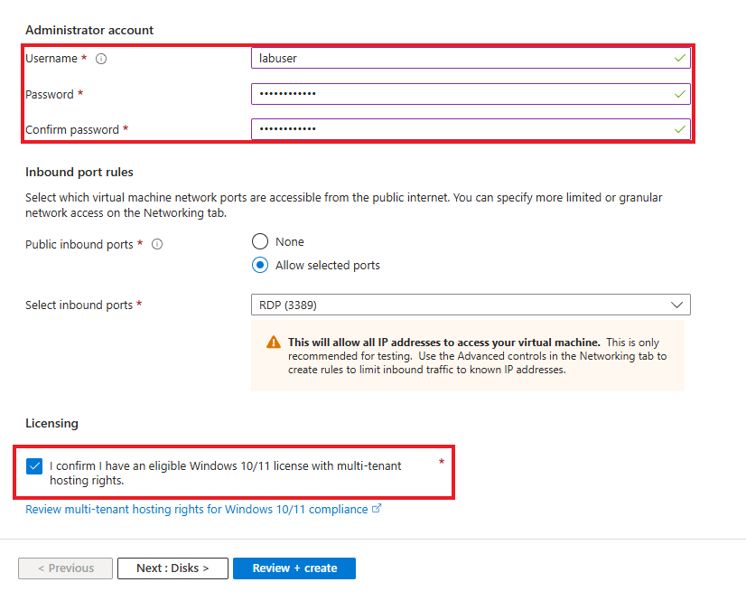
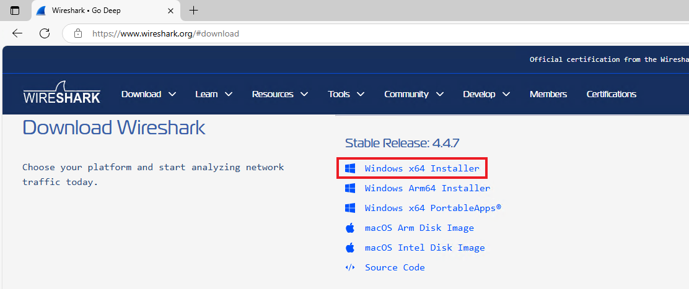
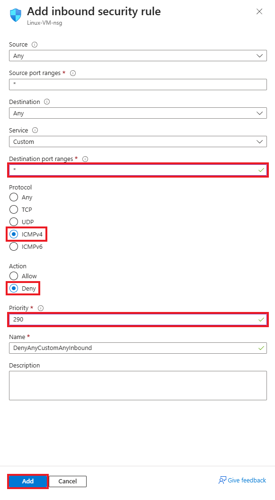
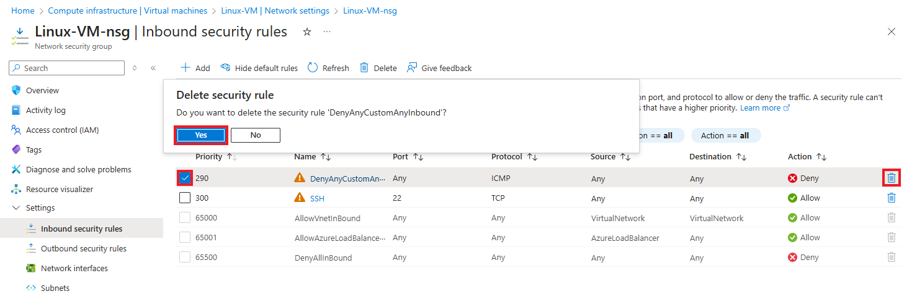

# Inspecting Network Protocols within Azure

This tutorial outlines the steps on how to observe network traffics and protocols using Wireshark within Azure Virtual Machines

## Prerequisites Needed
- Microsoft Azure Subscription (Free/Pay as you go)
  
## Environments Used
- Microsoft Azure (Cloud Environment)
- Windows 11 Pro (Virtual Machine OS)
- Ubuntu Server 24.04 (Virtual Machine OS)

## Technologies Used
- Azure Virtual Machines
- Windows Powershell (Commmand-line Shell)
- Wireshark (Packet Capture & Analysis)
- TCP/IP, HTTP, ICMP (Network Protocols)

## Content Sections
- [Create our Resources and Virtual Machines](#Create-our-Resources-and-Virtual-Machines)
- [Login using RDP and Installing Wireshark](#Login-using-RDP-and-Installing-Wireshark)
- [Observing ICMP Traffic](#Observing-ICMP-Traffic)
- Observing SSH Traffic
- Observing DHCP Traffic
- Observing DNS Traffic
- Observing RDP Traffic

## Create our Resources and Virtual Machines

*NOTE: Ensure that you are logged into your Microsoft Azure account, and have a subscription active*

### Step 1: Create a new resource group within Microsoft Azure

1.1 After logging into your Azure account, navigate to/search for "Resource Groups":

1.2 On the Resource Groups page, click Create to start a new resource group:

1.3 Fill out the following information:
- Select your subscription
- Name your resource group. For this lab it will be titled **Testing-RG**
- Choose the region you are residing in. For this lab, we will select **(US) East US**

Then Click Review + create to proceed.

Following this, you will be prompted to review your new resource group information on the next page. Ensure the information entered is correct, and then click Create to Proceed.

**A resource group has now succcesfully been created.**

### Step 2: Create a Windows 11 Virtual Machine

2.1 Search for "Virtual Machine" in the search bar, or navigate to the Virtual Machine section back on the home page.

2.2 On the Virtual Machine page, click **Create**, and then select **Virtual machine**.

2.3 Fill out the following information:
- Subscription - Select your current and active subscription
- Resource Group - Select the resource group previously made in Step 1: **"Testing-RG"**
- Virtual machine name - For this lab, we will name our VM:  **"Windows-VM"**
- Region - Select your current region. For this lab, we will select **"(US) East US"**
- Availablity Zone - Select **"Zone 3"**
- Image - Select **"Windows 11 Pro, version 24H2 - x64 Gen2"**
- Size - Select **"Standard_D2s_v3 - 2vcpus, 8GiB memory ($70.08/month)"**

Create your **Administrator account**.

- For this lab, we will use **labuser** as the username and **Cyberlab123!** as the password.

Check off the Licensing check box

Click **Next: Disks>**, and then **Next: Networking >**

2.4 Click **Create new** under Virtual Network. A window to create a virtual network should pop up

Create your **Virtual Network**

- For this lab, we will use **Lab-VNet** as the name of our virtual network

Click **OK** to proceed

Back on the Virtual Machine page, Click **Review + Create** to proceed  

2.5 Confirm that **Validation passed** for your virtual machine.

Review the the information you inputted, ensuring everything is correct.

Click **Create** once more to initialize deployment of your virtual machine.

**A Windows 11 Virtual Machine has now successfully been created.**

### Step 3: Create a Linux (Ubuntu Server) Virtual Machine

3.1 Search for "Virtual Machine" in the search bar, or navigate to the Virtual Machine section back on the home page.

3.2 On the Virtual Machine page, click **Create**, and then select **Virtual machine**.

3.3 Fill out the following information:
- Subscription - Select your current and active subscription
- Resource Group - Select the resource group previously made in Step 1: **"Testing-RG"**
- Virtual machine name - For this lab, we will name our VM:  **"Linux-VM"**
- Region - Select your current region. For this lab, we will select **"(US) East US"**
- Availablity Zone - Select **"Zone 3"**
- Image - Select **"Ubuntu Server 24.04 LTS - x64 Gen2"**
- Size - Select **"Standard_D2s_v3 - 2vcpus, 8GiB memory ($70.08/month)"**

Create your **Administrator account**.

- Select **Password** option for **Authentication Type**
- For this lab, we will use **labuser** as the username and **Cyberlab123!** as the password.

Click **Next: Disks>**, and then **Next: Networking >**

3.4 For our Virtual Network, we will be selecting the virtual network that we created when creating our Windows 11 virtual machine: **Lab-VNet**

Click **Review + Create** to proceed  

3.5 Confirm that **Validation passed** for your virtual machine.

Review the the information you inputted, ensuring everything is correct.

Click **Create** once more to initialize deployment of your virtual machine.

**A Linux Ubuntu Virtual Machine has now successfully been created** 👍

## Login using RDP and Installing Wireshark

### Step 1: Use Remote Desktop to connect to your Windows 11 Virtual Machine

1.1 On your Virtual Machine page within Azure, you will be able to see the designated Public IP Address for each virtual machine created.

Use the Windows 11 Virtual Machine's IP address to log in through Remote Desktop

1.2 A small windows security prompt will ask you to enter your credentials to log into the virtual machine

- We will use the username and password that we made when creating the virtual machines **(labuser/Cyberlab123!)**

Another windows prompt will appear, click **Yes** to proceed

Power on the Windows 11 virtual machine and proceed with the setup steps until you reach the Windows Desktop.

### Step 2: Installing Wireshark

2.1 Open Microsoft Edge and navigate to https://www.wireshark.org/. Download the installer labeled Windows x64 Installer.

2.2 Run the Wireshark installer and proceed through the installation by clicking 'Next' at each step to complete the setup

Once installation is complete, click **Finish**

2.3  Open up Wireshark. Once the application is running, performing the following steps:
- Highlight **Ethernet**
- Click the blue fin at the top left corner to start **capturing packets**

Once you have started capturing packets, you will notice a stream of entries in Wireshark. This is ongoing network traffic that is happening on the backend of your virtual machine. Your network protocol analyzer (Wireshark) is capturing all incoming and outgoing packets, and from here we are able to observe various types of network traffic and protocols in real time.

## Observing ICMP Traffic

ICMP (Internet Control Message Protocol) is a network protocol used for sending error messages and operational information. ICMP is the underlying protocol that makes the **ping** command functional. In this section, we will observe ICMP traffic through the following examples:
- [Between our Windows 11 and Linux Ubuntu virtual machines](#example-1-observing-icmp-traffic-between-virtual-machines)
- [Initiating a continuous ping and configuring firewall rules (e.g., Network Security Groups)](#example-2-initiating-a-continuous-ping-and-configuring-firewall-rules-eg-network-security-groups)

### Example 1: Observing ICMP traffic between virtual machines

To start, we will obtain the private IP address of our Linux Ubuntu virtual machine.

Head back to the virtual machine page on Azure, and click on **Linux VM**. On the right side of the page, under **Networking** the private IP address of the virtual machine should be displayed. This is the IP address that we will **ping** within our Windows 11 virtual machine.

On our Windows 11 virtual machine, filter out ICMP traffic on Wireshark by typing ICMP within the search/filter bar. This will result in only ICMP traffic being displayed.

In the windows search bar, search for and open the application, **Windows Powershell**,

From here, we will attempt to ping the Linux virtual machine using its private IP address to make contact.

Type the following: **ping 10.0.0.5**, then click Enter

A successful ping has been made, as the Linux virtual machine is responding back to the requests from our Windows virtual machine

Navigate back to Wireshark, and you will be able to see the ICMP traffic that occurred between both virtual machines.

You'll notice that **Wireshark displays 8 packet entries**, whereas **Windows PowerShell shows only 4**.

This is because:

- **Wireshark** captures **both the request and reply packets** of the ping command.
- **PowerShell** only displays the **replies** received from the Linux virtual machine.

As a result, each ping generates **two packets** (one request, one reply), and Wireshark provides a more detailed view of the full network exchange.

By analyzing these packets in Wireshark, we can clearly see the exchange of ICMP traffic between the two virtual machines.

### Example 2: Initiating a continuous ping and configuring firewall rules (e.g., Network Security Groups)

We will initiate a perpetual ping from the Windows 11 virtual machine to the Linux Ubuntu virtual machine.

To perform this, type the following into Windows Powershell, then run the command:

- **ping  10.0.0.5 -t**

_NOTE_: This is a continuation of the previous example, with the -t flag added to the ping command to create a continuous stream of ICMP requests between the Windows 11 and Linux Ubuntu virtual machines

Back on Wireshark, the same activity is reflected. You will see multiple request and reply packets being captured between both virtual machines.

**Now we are going to open up the Network Security Group for the Linux Ubuntu virtual machine, and disable incoming ICMP traffic. After, we will observe the network traffic in Wiresharkto see the resulting behavior.**

Head over to our Azure portal, and open up Linux-VM

Navigate to **Network settings** and under **Network Security Group**, click **Linux-VM-nsg**

_NOTE_: A Network Security Group (NSG) is a virtual firewall used in Microsoft Azure to control inbound and outbound network traffic to and from Azure resources, such as virtual machines (VMs), subnets, or network interfaces.

On the left hand side, click **Settings > Inbound security rules**, then click **Add**

Here we will create an inbound security rule preventing ICMP traffic from going into our Windows virtual machine. We will observe the activity that occurs afterwards.

Fill in the following information:

- Destination port ranges - * (just an asterisk)
- Protocol - **ICMPv4** (ICMP protocol)
- Action - **Deny** (Will prevent incoming ICMP traffic)
- Priority - **290** (Will be highest priority within our security rules)

Then click **Add** to create rule

Back on our Windows virtual machine, our perpetual ping within Windows Powershell will start to time out. This is because the inbound security rule that we created has started, and is blocking the ICMP request packets coming from the Windows virtual machine to the Linux virtual machine.

This results in the Windows virtual machine not being able to receive a reply packet, thus making our Powershell time out.

This is also reflected on Wireshark as well. No responses will be found as the request packets aren't going through.

With Network Security Groups, we are able to create rules to allow/deny certain network protocols for both inbound and outbound traffic

Let's go ahead and remove the inbound security rule we made. Go back into the Linux virtual machine's network security group in Azure and delete the inbound security rule by performing the following:

- Check security rule
- Click trash icon
- Click Yes to delete security rule

Back on our Windows virtual machine, our perpetual ping within Windows Powershell will continue again, as the security rule has been removed. Request and reply packets, and ICMP traffic can now communicate between virtual machines.

The ICMP traffic on Wireshark is now up and running as well.

