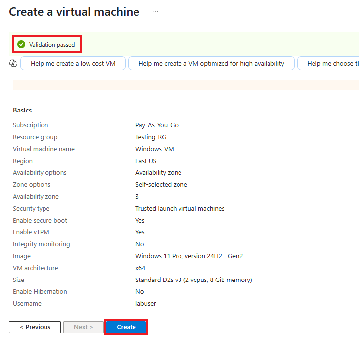
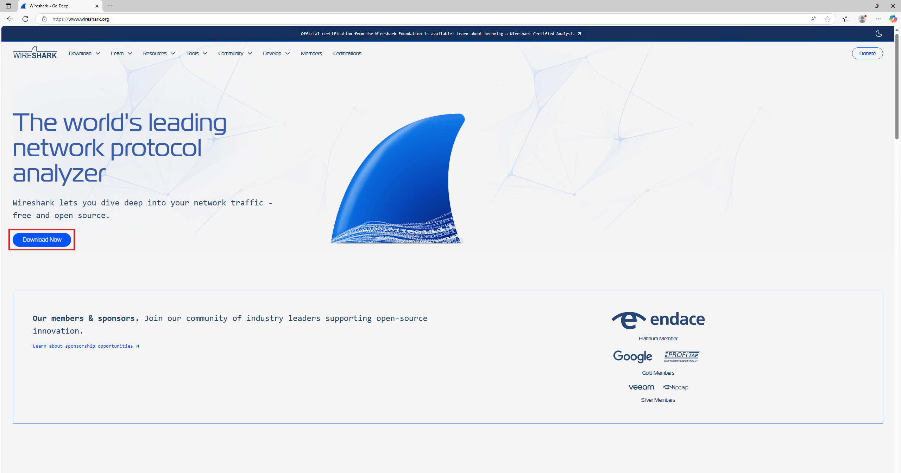

# Inspecting Network Protocols within Azure

This tutorial outlines the steps on how to observe network traffics and protocols using Wireshark within Azure Virtual Machines

## Prerequisites Needed
- Microsoft Azure Subscription (Free/Pay as you go)
  
## Environments Used
- Microsoft Azure (Cloud Environment)
- Windows 11 Pro (Virtual Machine OS)
- Ubuntu Server 24.04 (Virtual Machine OS)

## Technologies Used
- Azure Virtual Machines
- Wireshark (Packet Capture & Analysis)
- TCP/IP, HTTP, ICMP (Network Protocols)

## Content Sections
- [Create our Resources and Virtual Machines](#Create-our-Resources-and-Virtual-Machines)
- [Login using RDP & Installing Wireshark](#Login-using-RDP-&-Installing-Wireshark)
- Observing ICMP Traffic
- Observing SSH Traffic
- Observing DHCP Traffic
- Observing DNS Traffic
- Observing RDP Traffic

## Create our Resources and Virtual Machines

*NOTE: Ensure that you are logged into your Microsoft Azure account, and have a subscription active*

### Step 1: Create a new resource group within Microsoft Azure

1.1 After logging into your Azure account, navigate to/search for "Resource Groups":

1.2 On the Resource Groups page, click Create to start a new resource group:

1.3 Fill out the following information:
- Select your subscription
- Name your resource group. For this lab it will be titled **Testing-RG**
- Choose the region you are residing in. For this lab, we will select **(US) East US**

Then Click Review + create to proceed.

Following this, you will be prompted to review your new resource group information on the next page. Ensure the information entered is correct, and then click Create to Proceed.

**A resource group has now succcesfully been created.**

### Step 2: Create a Windows 11 Virtual Machine

2.1 Search for "Virtual Machine" in the search bar, or navigate to the Virtual Machine section back on the home page.

2.2 On the Virtual Machine page, click **Create**, and then select **Virtual machine**.

2.3 Fill out the following information:
- Subscription - Select your current and active subscription
- Resource Group - Select the resource group previously made in Step 1: **"Testing-RG"**
- Virtual machine name - For this lab, we will name our VM:  **"Windows-VM"**
- Region - Select your current region. For this lab, we will select **"(US) East US"**
- Availablity Zone - Select **"Zone 3"**
- Image - Select **"Windows 11 Pro, version 24H2 - x64 Gen2"**
- Size - Select **"Standard_D2s_v3 - 2vcpus, 8GiB memory ($70.08/month)"**

Create your **Administrator account**.

- For this lab, we will use **labuser** as the username and **Cyberlab123!** as the password.

Check off the Licensing check box

Click **Next: Disks>**, and then **Next: Networking >**

2.4 Click **Create new** under Virtual Network. A window to create a virtual network should pop up

Create your **Virtual Network**

- For this lab, we will use **Lab-VNet** as the name of our virtual network

Click **OK** to proceed

Back on the Virtual Machine page, Click **Review + Create** to proceed  

2.5 Confirm that **Validation passed** for your virtual machine.

Review the the information you inputted, ensuring everything is correct.

Click **Create** once more to initialize deployment of your virtual machine.

**A Windows 11 Virtual Machine has now successfully been created.**

### Step 3: Create a Linux (Ubuntu Server) Virtual Machine

3.1 Search for "Virtual Machine" in the search bar, or navigate to the Virtual Machine section back on the home page.

3.2 On the Virtual Machine page, click **Create**, and then select **Virtual machine**.

3.3 Fill out the following information:
- Subscription - Select your current and active subscription
- Resource Group - Select the resource group previously made in Step 1: **"Testing-RG"**
- Virtual machine name - For this lab, we will name our VM:  **"Linux-VM"**
- Region - Select your current region. For this lab, we will select **"(US) East US"**
- Availablity Zone - Select **"Zone 3"**
- Image - Select **"Ubuntu Server 24.04 LTS - x64 Gen2"**
- Size - Select **"Standard_D2s_v3 - 2vcpus, 8GiB memory ($70.08/month)"**

Create your **Administrator account**.

- Select **Password** option for **Authentication Type**
- For this lab, we will use **labuser** as the username and **Cyberlab123!** as the password.

Click **Next: Disks>**, and then **Next: Networking >**

3.4 For our Virtual Network, we will be selecting the virtual network that we created when creating our Windows 11 virtual machine: **Lab-VNet**

Click **Review + Create** to proceed  

3.5 Confirm that **Validation passed** for your virtual machine.

Review the the information you inputted, ensuring everything is correct.

Click **Create** once more to initialize deployment of your virtual machine.

**A Linux Ubuntu Virtual Machine has now successfully been created** 👍

## Login using RDP & Installing Wireshark

### Step 1: Use Remote Desktop to connect to your Windows 11 Virtual Machine

1.1 On your Virtual Machine page within Azure, you will be able to see the designated Public IP Address for each virtual machine created.

Use the Windows 11 Virtual Machine's IP address to log in through Remote Desktop

1.2 A small windows security prompt will ask you to enter your credentials to log into the virtual machine

- We will use the username and password that we made when creating the virtual machines **(labuser/Cyberlab123!)**

Another windows prompt will appear, click **Yes** to proceed

Power on the Windows 11 virtual machine and proceed with the setup steps until you reach the Windows Desktop.

Open Microsoft Edge and navigate to https://www.wireshark.org/. Download the installer labeled Windows x64 Installer.

Run the Wireshark installer and proceed through the installation by clicking 'Next' at each step to complete the setup

Once installation is complete, click **Finish**

0.0 Open up Wireshark. Once the application is running, performing the following steps:
- Highlight **Ethernet**
- Click the blue fin at the top left corner to start **capturing packets**

